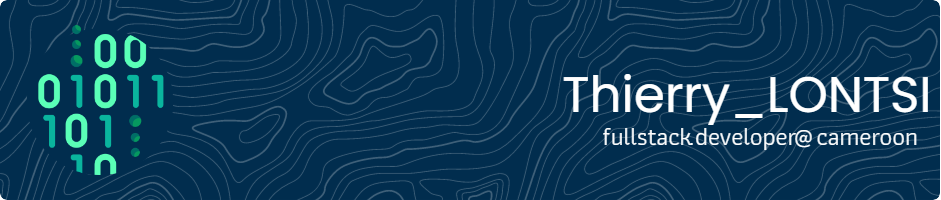

#

## Readme status

 

#

## Let's get in touch maybe ?

 

#

## My everyday environment[s] and tools (most of them at least)

 

 

#

## You know... The usual git stats and stuff. Working on it though 😅

 

#

## Felt like showing off a bit, so here's a list of all the technologies I'm working with so far

 

                                                                          

 

> I made this ASCII art out of boredom, and now I don't feel like deleting it since it took me a while to make it 🥲😅; so here I am, wasting some useful space on my README file.

> I hope you like it, and if you don't, it's fine too... I'm just not yet ready to hit `DEL` on it 😂😂.

    ████████████████████████████████████████████████████████████
    ████████████████████████████████████████████████████████████
    ███████████████████████████████████`.        ╙██████████████
    ████████████████████████████████▀  ¿▓▓▓▓▓▓▓▓▄/ "████████████
    ██████████████████████████████▀.  ▓▓▓▓▓▓▓▓▓▓▓▓   ▐██████████
    ██████████████████████████████ `  ▓▓▓▓▓▓▓▓▓▓▓▓  ` ██████████
    ██████████████████████████████ `  ▓▓▓▓▓▓▓▓▓▓▓▓   ▄██████████
    ▀██████████████████████████████▌  ▀▀▓▓▓▓▓▓▓▌╓╖. ████████████
    █▄▀██████████████████████████████▄ ╩╦╙▀▀▀▀▀ ╣`,█████████████
    ▄▀█▄╙█████████████████████▀▀▀▀█████▄▄ .... ,▄███████▀███████
    ██▄▀█▄╙█████████████████▀  ╪╢%╦══~╓,└ ╚▒▒▒ ╙▀|,╓╓═╤H   ▀████
    █▀▀▀-▀█▌▄▀█████████████   ║▒▒▒▒▒▒▒▒▒▒╢╦ ╘ -╣▒▒▒▒▒▒▒▒▒╢╕   ▀█
    ██▄▀██└║▄▄▄████████████▄          ═╕╕╕╕╕═╕═══════       ▄▄▄▄
    ████▄▀█▌║███  ████████▌         ╕   ╩▒▒▒▒▒▒▒▒▒Ñ          ███
    ██████▌Ö▓▌   ▀██████████`╔▒▒╣ █ ▒▒m   ╚▒╢▒▒▒╩ -╣▒ ▌ ▒▒▒ ████
    ████ -"" ∞╙,▀.╙▀███████╜ ▒▒▒ ▄█ Ñ   -   S.  ═▒▒▒▒ █ ║▒▒╕└███
    ████████▄ -«   ∞▄.▀",╓═     ╒██   ═╣▒▒ `Ñ╛        █▌ ▒▒▒ ███
    █████████▌ º     ╤╣▒╣╩^",▄▄███▀  ▒▒╣"     ''''''' ▀▀     `██
    █████████  ▌       ▄▄████████─         ---------    L'▒▒▒ ██
    ▀▀▀▀▀▀▀▀▀▀▀▀▀-     ▀▀▀▀▀▀▀▀▀▀       '╧╧╧╧╧╧╧╧╧`     ╚ ╧╧╧- ▀
